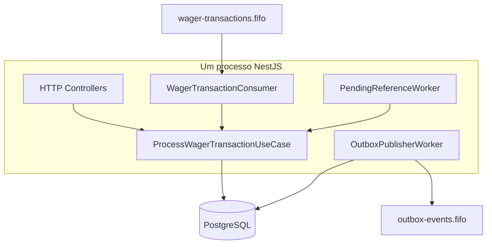
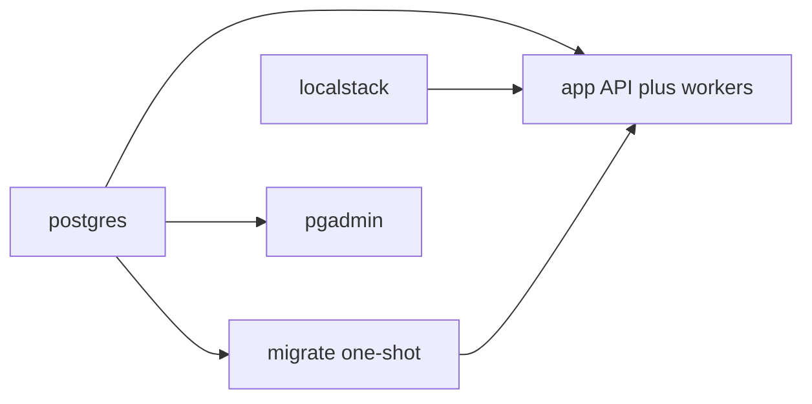
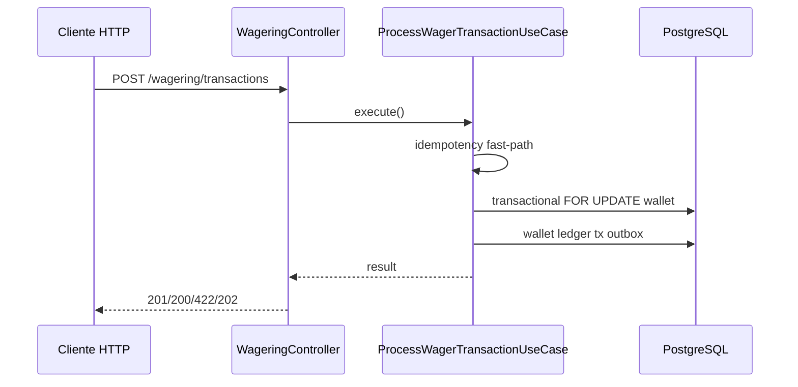
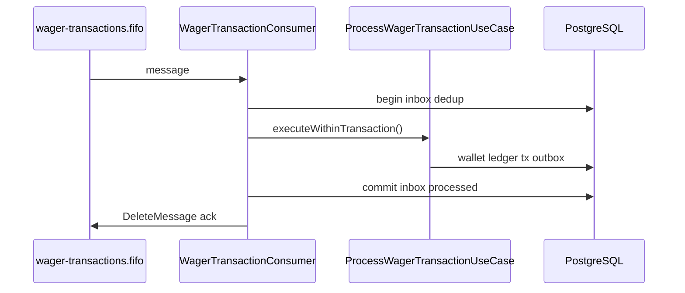

# Arquitetura

Monólito modular. O domínio não depende de NestJS, MikroORM nem SQS. PostgreSQL é a fonte da verdade para saldo, ledger, idempotência (inbox + chaves de transação) e eventos pendentes (outbox).

```
HTTP / SQS
    → use cases (orquestração)
        → entidades de domínio
            → PostgreSQL (mesma transação SQL)
                → outbox → SQS (depois do commit)
```

| Camada | Responsabilidade |
|---|---|
| `src/domain` | `Money`, `Wallet`, `WagerTransaction`, ledger, inbox/outbox, eventos |
| `src/application` | Use cases e portas |
| `src/infrastructure` | HTTP, MikroORM, SQS, health, logs, métricas |

HTTP, o consumidor SQS e o worker de pending-reference chamam o mesmo `ProcessWagerTransactionUseCase` (com fronteiras transacionais diferentes).

## Escopo: implementado vs. não implementado

Priorização alinhada à tabela de avaliação do desafio (correção financeira, concorrência, idempotência e mensageria vêm antes de auth e observabilidade).

### Implementado

| Área | O que foi feito |
|---|---|
| Correção financeira | `Money` com `big.js`, ledger imutável, reversões, reconciliação |
| Concorrência | Lock pessimista por wallet; testes de hot wallet e 50× idempotente |
| Idempotência | Chave persistente + `payloadHash`; inbox por `(consumerName, messageId)` |
| Mensageria | Inbox/outbox transacionais, DLQ, pending-reference worker, graceful shutdown |
| Persistência | MikroORM, migrations, constraints no schema |
| API | Endpoints do enunciado + health/metrics |
| Observabilidade | Logs JSON, métricas Prometheus, health live/ready |

### Não implementado (decisão consciente)

| Item | Por quê |
|---|---|
| Autenticação / IdP | Não pontua no desafio; ver [Autenticação](#autenticação) |
| OpenTelemetry / dashboard | Opcional no enunciado |
| Teste de carga (`test:load`) | Diferencial não feito |
| Paginação server-side do ledger | Cursor na API; slice em memória no use case — ver [Trade-offs](#trade-offs-e-limitações) |
| Microserviços | Monólito modular por requisito do desafio |
| Processos worker-only | API e workers rodam no mesmo binário — ver [Modelo de execução](#modelo-de-execução) |

## Modelo de execução

Um único processo NestJS sobe, via `OnApplicationBootstrap`:

- **HTTP** — controllers REST
- **WagerTransactionConsumer** — poll em `wager-transactions.fifo`
- **OutboxPublisherWorker** — publica linhas pendentes em `outbox-events.fifo`
- **PendingReferenceWorker** — reprocessa transações em `PENDING_REFERENCE`



- Workers embutidos no mesmo binário — não há serviço separado só para mensageria.
- Container `app` usa `init: true` no Docker Compose para repasse correto de sinais.
- **Graceful shutdown:** `onApplicationShutdown` seta flag `stopped` e aguarda o poll em andamento terminar antes de encerrar (consumer, outbox e pending-reference).

## Docker Compose (topologia local)



| Serviço | Papel |
|---|---|
| `postgres` | Banco principal (`wagering`) |
| `localstack` | SQS; filas criadas por [`localstack/init-queues.sh`](localstack/init-queues.sh) |
| `migrate` | One-shot: `bunx mikro-orm migration:up` antes do `app` |
| `app` | API + workers (`start:dev` no container — modo dev com hot reload; stage `production` do Dockerfile usa `start:prod`) |
| `pgadmin` | UI opcional |

**Como rodar:** ver [README — Como rodar](./README.md#como-rodar). Fluxo Docker completo não exige Bun no host; fluxo infra + host sobe só `postgres` e `localstack` (sem o serviço `app`).

O compose padrão sobe **uma instância** do `app` em `:3000`. Para N instâncias localmente, ver [README — Múltiplas instâncias](./README.md#múltiplas-instâncias).

## Entradas e fronteiras transacionais

O `ProcessWagerTransactionUseCase` expõe três entry points:

| Método | Quem chama | Transação |
|---|---|---|
| `execute()` | API HTTP | Abre transação própria (fast-path de idempotência *fora* dela) |
| `executeWithinTransaction()` | Consumidor SQS | Chamador já abriu transação (inbox no mesmo commit) |
| `reprocessPendingReferenceWithinTransaction()` | Pending-reference worker | Chamador já abriu transação |





Transações aninhadas (savepoints) foram evitadas: uma transação plana facilita auditar a atomicidade entre inbox, ledger e outbox.

### Caminho feliz dentro da transação

1. `SELECT FOR UPDATE` na wallet — serializa operações da mesma wallet
2. Check de idempotência definitivo
3. `WagerTransaction.create()` em `PENDING`
4. Se exige referência: busca `(providerId, referenceExternalTransactionId)`. Ausente → `PENDING_REFERENCE`
5. `validateReferenceCompatibility` — tipo, rodada, escopo, moeda e valor
6. Para REFUND/ROLLBACK: verifica reversão PROCESSED existente na mesma referência
7. Aplica operação financeira (`debit` / `credit`), gera lançamento no ledger
8. Grava `PROCESSED`, ledger e outbox — mesmo commit

## Multi-instância e concorrência

Unidade de concorrência: **`walletId`**.

| Mecanismo | Onde | Efeito |
|---|---|---|
| `SELECT FOR UPDATE` | Wallet | Serializa BET/WIN/REFUND/ROLLBACK da mesma wallet |
| `SELECT FOR UPDATE SKIP LOCKED` | Outbox, pending-reference | N instâncias reclamam linhas diferentes |
| Inbox `(consumerName, messageId)` | Consumidor SQS | Redelivery não duplica efeito financeiro |
| Unique constraints | Schema | Última linha de defesa (idempotency key, ledger por tx) |

`version` incrementa só quando o saldo muda (invariante de domínio). Não é o mecanismo de lock — o pessimistic lock evita lost update sem retry de write conflict.

Wallets distintas processam em paralelo. Três ou mais instâncias disputando a mesma wallet produzem exatamente um débito por operação idempotente — coberto em [`test/concurrency/`](test/concurrency/).

**Outbox entre instâncias:** `findPending` usa `SKIP LOCKED`, mas a transação de leitura commita antes da publicação SQS. Duas instâncias podem publicar o mesmo evento (at-least-once). Consumidores downstream devem ser idempotentes — invariantes financeiras permanecem no banco.

## Autenticação

Não implementada. Autenticação não pontua no desafio; o tempo foi para correção financeira, concorrência e idempotência.

Desenho que seria adotado:

- Identity Provider externo (Keycloak / OIDC), sem tabela própria de usuários
- Guard NestJS nas rotas HTTP validando JWT. Health e métricas ficam abertos
- SQS é canal interno confiável. A identidade do provedor no payload continua sujeita às regras de domínio

## Persistência

**MikroORM** — escolhido por:

- **Unit of Work** — mudanças acumulam em memória; um `flush()` por transação
- **`LockMode` explícito** — `PESSIMISTIC_WRITE` e `PESSIMISTIC_PARTIAL_WRITE` visíveis no código
- **`EntityManager.transactional()`** — contexto via AsyncLocalStorage, sem passar `em` entre camadas
- **Identity Map** — mesma entidade carregada duas vezes retorna o mesmo objeto

**Money:** `big.js` no domínio (nunca `number`). Persistência: `numeric(18,2)` + ISO-4217. Reidratação via `Money.from`. Serialização com 2 casas.

**Transação:** wallet, ledger, transação, inbox (entrada SQS) e outbox no mesmo commit. Eventos só são publicados depois.

Constraints no schema (não só no código):

- uma wallet por `(player_id, currency)`
- saldo e valores monetários `>= 0`
- unicidade de `(provider_id, idempotency_key)` e `(provider_id, external_transaction_id)`
- no máximo um lançamento por `(wallet_id, transaction_id)`
- inbox por `(message_id, consumer_name)`

## Transições de `WagerTransaction`

`create` nasce em `PENDING`. `OPENING` não entra por API/SQS (`createOpening` só no use case de wallet).

```
PENDING ──► PROCESSED
PENDING ──► PENDING_REFERENCE ──► PROCESSED
                          └──► PENDING_REFERENCE (retry)
                          └──► REJECTED
PENDING ──► REJECTED
qualquer não-terminal ──► FAILED
```

`PROCESSED`, `REJECTED` e `FAILED` são terminais. Nova transição lança erro de programação.

## Interpretações além do enunciado

- `WIN` pode omitir referência e ser processado na hora. Se trouxer `referenceExternalTransactionId` e a BET ainda não existir, vai para `PENDING_REFERENCE`.
- `WIN` com referência deve apontar para uma `BET` `PROCESSED` do mesmo escopo. O montante do `WIN` não precisa ser igual ao da `BET`.
- **WIN não é reversão** para deduplicação (`findProcessedReversalByReferenceId` filtra `REFUND` e `ROLLBACK`). Permite `BET → WIN(ref=BET) → REFUND(ref=BET)`.
- **Deduplicação de reversão conservativa:** qualquer reversão `PROCESSED` na mesma referência bloqueia outra — mesmo que o tipo seja diferente (evita crédito duplo).
- Replay idempotente devolve o saldo observado na aplicação original (`observedBalance`).
- Moeda única na prática (`BRL`); o modelo continua multi-moeda e rejeita conflito de moeda.

## Códigos de falha

| Código | Quando | Provedor |
|---|---|---|
| `INSUFFICIENT_BALANCE` | `BET` sem saldo | não reenviar o mesmo valor |
| `REVERSAL_WOULD_NEGATE_BALANCE` | `ROLLBACK` deixaria saldo negativo | distinto de aposta sem saldo |
| `CURRENCY_MISMATCH` | moeda ≠ wallet | corrigir payload |
| `REFERENCE_NOT_FOUND` | referência não apareceu após o limite | desistir ou reenviar a referência |
| `INVALID_REFERENCE` | tipo, rodada, valor ou escopo inválidos | corrigir payload |
| `REVERSAL_ALREADY_APPLIED` | reversão já processada | não reenviar |
| `PAYLOAD_CONFLICT` | mesma idempotency key, payload diferente | não é replay |
| `INVALID_TRANSACTION_STATE` | transição sobre estado terminal | bug, não reenviar |
| `INFRASTRUCTURE_ERROR` | falha permanente após retries SQS | investigar / DLQ |

## Idempotência e hash

Fonte da verdade: header `Idempotency-Key`.

`payloadHash` = SHA-256 de JSON canônico (chaves ordenadas) de:

`providerId`, `externalTransactionId`, `playerId`, `walletId`, `roundId`, `gameId`, `kind`, `money`, `referenceExternalTransactionId` (se houver).

Header e metadados de transporte ficam de fora. Mesma key + mesmo hash → replay. Mesma key + hash diferente → `409`.

## Status HTTP

Situações distintas não compartilham o mesmo código.

| Situação | Status |
|---|---|
| Payload / header inválido | `400` |
| Wallet / transação inexistente | `404` |
| Wallet duplicada ou conflito de idempotência | `409` |
| Rejeição de negócio (`REJECTED`) | `422` |
| `PENDING` / `PENDING_REFERENCE` | `202` |
| `PROCESSED` primeira vez | `201` |
| Replay idempotente | `200` |
| Infra transitória | `503` |

Body de `POST /wagering/transactions`: `transactionId`, `status`, `balance`, `idempotentReplay`, `failureCode` (quando `REJECTED`). Detalhes adicionais no `GET` da transação.

## Mensageria

Filas FIFO (criadas em [`localstack/init-queues.sh`](localstack/init-queues.sh)):

| Fila | Uso |
|---|---|
| `wager-transactions.fifo` | Entrada de apostas |
| `wager-transactions-dlq.fifo` | DLQ de entrada |
| `outbox-events.fifo` | Eventos de integração publicados |
| `outbox-events-dlq.fifo` | DLQ de eventos |

FIFO é otimização; invariantes ficam no banco. `RedrivePolicy` com `maxReceiveCount = 5` (alinhado a `SQS_MAX_RECEIVE_COUNT`).

### Consumidor (`WagerTransactionConsumer`)

- Inbox persistente `(consumerName, messageId)`
- Mesmo use case da API (`executeWithinTransaction`)
- Ack (`DeleteMessage`) só depois do commit
- Rejeição de negócio → ack (terminal)
- Erro transitório → sem ack (retry SQS)
- Conflito de payload da inbox → DLQ
- `SIGTERM` → espera poll em andamento

### Outbox (`OutboxPublisherWorker`)

- Gravada no commit financeiro
- Publicação assíncrona com backoff `5s × 2^(attempts−1)`, teto 5 min
- Publicação duplicada tolerada (at-least-once)

### Eventos mínimos

| Evento | Quando |
|---|---|
| `WagerTransactionProcessed` | transação aplicada (inclui `LOSS`) |
| `WagerTransactionRejected` | rejeição de negócio |
| `WalletBalanceChanged` | somente quando o saldo muda |
| `WagerTransactionPendingReference` | referência ausente |

## `PENDING_REFERENCE`

Worker com backoff `5s × 2^attempts`, teto 5 min, **20 tentativas** (`PENDING_REFERENCE_MAX_ATTEMPTS`).

Cobre mensagens fora de ordem sem esperar indefinidamente. Esgotado o limite: `REJECTED` + `REFERENCE_NOT_FOUND` e evento correspondente.

## Status `FAILED`

Terminal e auditável — falha permanente de infraestrutura, distinto de `REJECTED` (negócio) e `PENDING_REFERENCE` (aguardando referência).

O consumidor SQS, ao atingir `SQS_MAX_RECEIVE_COUNT` (padrão 5), tenta em transação separada (best-effort) `failTransactionIfExistsWithinTransaction` → `FAILED` + `INFRASTRUCTURE_ERROR` antes da mensagem ir para a DLQ.

**Limitação:** se o erro ocorreu antes do primeiro commit, não há registro para marcar. A DLQ é a evidência; a `WagerTransaction` não existe no banco. Intrínseco ao at-least-once com commit atômico.

## Observabilidade

Logs JSON com `correlationId`, `messageId`, `transactionId`, `walletId`, `providerId`. Sem payload financeiro completo.

Métricas em `GET /metrics`: transações por status, duplicatas, retries, DLQ, conflitos de lock, lag da outbox, latência.

`GET /health/live` (processo) e `GET /health/ready` (PostgreSQL + SQS), sem autenticação.

Reconciliação não corrige divergência: devolve `consistent` e a diferença.

## Trade-offs e limitações

- Lock pessimista por wallet: correto em hot wallet, serializa essa wallet. Optimistic lock com retry evitaria espera, mas exigiria mais reprocessamento.
- `version` não participa do `UPDATE`. Basta o `FOR UPDATE`.
- Ledger pagina em memória depois de carregar todos os lançamentos da wallet.
- Outbox: claim com `SKIP LOCKED` não segura a linha até publicar — possível publicação duplicada.
- 409 de unique violation (`23505`) inspeciona `constraint`: `wallet_player_id_currency_unique` → `WALLET_CONFLICT`; outras → `CONFLICT` com nome da constraint.
- Sem Auth/IdP (ver [Autenticação](#autenticação)).
- Sem OpenTelemetry.
- Compose local sobe uma instância; multi-instância documentada no README (processos no host).
